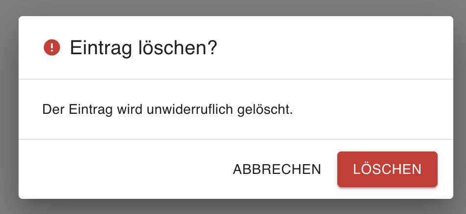

# ConfirmDialog — User Manual

> [Deutsche Version →](ConfirmDialog.de.md)

## Overview

`ConfirmDialog` is a declarative confirmation dialog system built on MUI. It replaces the repetitive `useState + Dialog + DialogTitle + DialogContent + DialogActions` boilerplate with a single `await confirm({ ... })` call — usable from anywhere inside the app tree.

**Typical use cases:**

- Confirming destructive actions (delete, reset, publish)
- Alerting users to important information with a single OK button
- Collecting a binary yes/no decision before a side effect



---

## Prerequisites

| Dependency | Minimum version |
|---|---|
| React | 19 |
| TypeScript | 5.x |
| Material UI (`@mui/material`) | 9 |
| `@mui/icons-material` | 9 |

No additional peer dependencies beyond the standard MUI stack.

---

## Import

```tsx
import {
  ConfirmDialogProvider,
  useConfirm,
  DEFAULT_CONFIRM_DIALOG_TRANSLATION,
} from '@thebuoyant-tsdev/mui-ts-library';
import type {
  ConfirmDialogOptions,
  ConfirmDialogSeverity,
  ConfirmDialogTranslation,
  ConfirmDialogProviderProps,
} from '@thebuoyant-tsdev/mui-ts-library';
```

---

## Quick Start

```tsx
// 1. Wrap the app once (e.g. in main.tsx or App.tsx)
import { ConfirmDialogProvider } from '@thebuoyant-tsdev/mui-ts-library';

function App() {
  return (
    <ConfirmDialogProvider>
      <MyApp />
    </ConfirmDialogProvider>
  );
}

// 2. Use the hook anywhere inside
import { useConfirm } from '@thebuoyant-tsdev/mui-ts-library';

function DeleteButton({ onDelete }: { onDelete: () => void }) {
  const confirm = useConfirm();

  const handleClick = async () => {
    const confirmed = await confirm({
      title:        'Delete entry?',
      description:  'This action cannot be undone.',
      confirmLabel: 'Delete',
      severity:     'error',
    });
    if (confirmed) onDelete();
  };

  return <button onClick={handleClick}>Delete</button>;
}
```

---

## `ConfirmDialogProvider` Props

| Prop | Type | Default | Description |
|---|---|---|---|
| `children` | `ReactNode` | — | App content wrapped by the provider |
| `translation` | `Partial<ConfirmDialogTranslation>` | — | Default labels for all dialogs opened via this provider |

---

## `useConfirm` — Hook

```ts
const confirm = useConfirm();
const confirmed: boolean = await confirm(options);
```

Returns `true` when the user clicks the confirm button, `false` for cancel, Escape, or backdrop click.

---

## `ConfirmDialogOptions`

All properties are optional. Each call to `confirm()` can pass any subset of them.

| Option | Type | Default | Description |
|---|---|---|---|
| `title` | `string` | — | Dialog heading |
| `description` | `string \| ReactNode` | — | Body text or arbitrary JSX |
| `confirmLabel` | `string` | from `translation` | Overrides the provider-level confirm label for this call |
| `cancelLabel` | `string` | from `translation` | Overrides the provider-level cancel label for this call |
| `severity` | `ConfirmDialogSeverity` | `"info"` | Colors the confirm button and shows a matching icon |
| `hideCancelButton` | `boolean` | `false` | Hides the cancel button (alert / notice mode) |
| `maxWidth` | `"xs" \| "sm" \| "md" \| "lg" \| "xl"` | `"xs"` | MUI Dialog max-width |
| `showIcon` | `boolean` | `true` | Shows/hides the severity icon in the title |

---

## TypeScript Types

### `ConfirmDialogSeverity`

```ts
type ConfirmDialogSeverity = "info" | "warning" | "error" | "success";
```

| Value | Button color | Icon |
|---|---|---|
| `"info"` | `primary` | Info circle |
| `"warning"` | `warning` | Warning triangle |
| `"error"` | `error` | Error circle |
| `"success"` | `success` | Check circle |

### `ConfirmDialogTranslation`

```ts
type ConfirmDialogTranslation = {
  confirmLabel: string;   // "Confirm"
  cancelLabel:  string;   // "Cancel"
};
```

```tsx
import { DEFAULT_CONFIRM_DIALOG_TRANSLATION } from '@thebuoyant-tsdev/mui-ts-library';
// { confirmLabel: "Confirm", cancelLabel: "Cancel" }
```

---

## Severity

```tsx
{/* Error — red confirm button */}
const ok = await confirm({ title: 'Delete?', severity: 'error', confirmLabel: 'Delete' });

{/* Warning — amber confirm button */}
const ok = await confirm({ title: 'Publish?', severity: 'warning' });

{/* Success — green confirm button */}
const ok = await confirm({ title: 'Mark as done?', severity: 'success' });

{/* Info (default) — primary confirm button */}
const ok = await confirm({ title: 'Confirm?' });
```

---

## Alert Mode (no cancel button)

```tsx
await confirm({
  title:           'Session expires soon',
  description:     'Your session will expire in 5 minutes. Please save your work.',
  confirmLabel:    'Got it',
  hideCancelButton: true,
  severity:        'warning',
});
```

Resolves `true` when the user clicks the button. Backdrop click and Escape still resolve `false`.

---

## ReactNode Description

```tsx
import { Stack, Typography } from '@mui/material';

await confirm({
  title:   'Terms of Service',
  description: (
    <Stack spacing={1}>
      <Typography variant="body2">
        By confirming, you agree to our terms of service.
      </Typography>
      <Typography variant="body2" color="text.secondary">
        You can revoke your consent at any time in your account settings.
      </Typography>
    </Stack>
  ),
  confirmLabel: 'I agree',
  cancelLabel:  'Decline',
  maxWidth:     'sm',
});
```

---

## i18n — Provider-level Translations

Override the default labels globally for all dialogs in the subtree:

```tsx
<ConfirmDialogProvider
  translation={{ confirmLabel: 'Bestätigen', cancelLabel: 'Abbrechen' }}
>
  <App />
</ConfirmDialogProvider>
```

Per-call `confirmLabel` / `cancelLabel` in `ConfirmDialogOptions` always take precedence over the provider default.

---

## Label Priority

```
per-call option (confirmLabel / cancelLabel)
  ↓ if not set
provider translation (ConfirmDialogProvider translation prop)
  ↓ if not set
DEFAULT_CONFIRM_DIALOG_TRANSLATION ("Confirm" / "Cancel")
```

---

## Behavior Details

| Scenario | Result |
|---|---|
| User clicks Confirm | `Promise<true>` |
| User clicks Cancel | `Promise<false>` |
| User presses Escape | `Promise<false>` |
| User clicks backdrop | `Promise<false>` |
| Second `confirm()` while dialog is open | First promise resolves `false`; second dialog opens |

---

## Storybook Stories

| Story | Description |
|---|---|
| `Default` | Basic confirm dialog with title and description |
| `NoDescription` | Title only, no body text |
| `Destructive` | `severity="error"` — red confirm button |
| `Warning` | `severity="warning"` — amber confirm button |
| `Success` | `severity="success"` — green confirm button |
| `AlertOnly` | `hideCancelButton=true` — single OK button |
| `NoIcon` | `showIcon=false` — no severity icon in title |
| `CustomLabels` | Per-call label override |
| `LargeDialog` | `maxWidth="sm"` with ReactNode body |
| `GermanTranslation` | Provider-level German labels |
| `MultipleDialogs` | Two independent triggers, one provider |

---

## Architecture Decisions

| Topic | Decision |
|---|---|
| **`resolveRef` instead of state** | The resolve function is stored in a `useRef` to avoid stale-closure issues — the handler always calls the latest version |
| **Single Dialog per Provider** | Only one dialog is rendered in the DOM at any time; a second `confirm()` call auto-cancels the previous promise with `false` |
| **Per-call label beats provider** | `confirmLabel` / `cancelLabel` in `ConfirmDialogOptions` take precedence over the provider `translation`, which itself falls back to `DEFAULT_CONFIRM_DIALOG_TRANSLATION` |
| **Backdrop / Escape = cancel** | The MUI Dialog `onClose` callback (triggered by both) always resolves the promise as `false` |
| **Internal dialog component** | The dialog UI is not exported — it is an implementation detail of the provider and cannot be rendered standalone |
