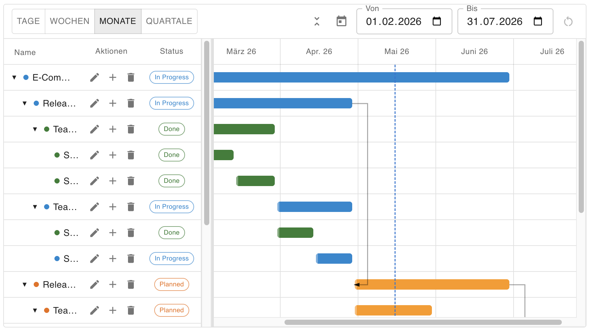

# GanttChart — Benutzerhandbuch

## Überblick

Der `GanttChart` ist eine vollständig interaktive Projektplanungs-Komponente auf Basis von React und Material UI. Er visualisiert Aufgaben (Tasks) als Balken auf einer Zeitleiste und unterstützt hierarchische Strukturen, Abhängigkeiten zwischen Tasks, Drag & Drop, Inline-Bearbeitung sowie einen kritischen-Pfad-Modus.

**Typische Einsatzgebiete:**

- Projektmanagement-Anwendungen (Sprint-Planung, Release-Roadmaps)
- Ressourcenplanung und Kapazitätsdarstellung
- Visualisierung von Meilensteinen in agilen Projekten
- Dashboards mit zeitlicher Übersicht über laufende Aufgaben



---

## Technische Voraussetzungen

| Abhängigkeit | Mindestversion |
|---|---|
| React | 19 |
| TypeScript | 5.x |
| Material UI (`@mui/material`) | 7 |
| Zustand | 5 |

---

## Import

```tsx
import { GanttChart } from '@tsdev/mui-ts-library';
import type {
  GanttTask,
  GanttTaskStatus,
  GanttTimeScale,
  GanttTheme,
  GanttTranslations,
  GanttToolbarConfig,
  GanttStatusColors,
} from '@tsdev/mui-ts-library';
```

---

## Schnellstart

```tsx
import { GanttChart } from '@tsdev/mui-ts-library';
import type { GanttTask } from '@tsdev/mui-ts-library';

const tasks: GanttTask[] = [
  {
    id: 'projekt',
    name: 'Webseite Relaunch',
    status: 'in-progress',
    startDate: new Date('2025-01-01'),
    endDate: new Date('2025-06-30'),
  },
  {
    id: 'design',
    parentId: 'projekt',
    name: 'Design-Phase',
    status: 'done',
    startDate: new Date('2025-01-01'),
    endDate: new Date('2025-02-28'),
  },
  {
    id: 'entwicklung',
    parentId: 'projekt',
    name: 'Entwicklung',
    status: 'in-progress',
    startDate: new Date('2025-03-01'),
    endDate: new Date('2025-05-31'),
    dependencies: ['design'],
  },
];

function App() {
  return (
    <GanttChart
      tasks={tasks}
      timeScale="months"
      height={400}
    />
  );
}
```

---

## Props-Referenz

### Datenstruktur: `GanttTask`

Jede Aufgabe wird als `GanttTask`-Objekt übergeben. Die `tasks`-Prop erwartet ein flaches Array — die Hierarchie wird intern aus `parentId`-Referenzen aufgebaut.

| Feld | Typ | Pflicht | Beschreibung |
|---|---|---|---|
| `id` | `string` | **Ja** | Eindeutige Kennung des Tasks. Wird als React-Key und für Abhängigkeits-Referenzen verwendet. Muss innerhalb der `tasks`-Liste einmalig sein. |
| `name` | `string` | **Ja** | Anzeigename des Tasks im linken Panel und in Dialogen. |
| `status` | `GanttTaskStatus` | **Ja** | Aktueller Status: `"planned"` · `"in-progress"` · `"done"` · `"blocked"`. Steuert Balkenfarbe und Status-Chip. |
| `startDate` | `Date` | **Ja** | Startdatum des Tasks. Bestimmt die linke Kante des Balkens. |
| `endDate` | `Date` | **Ja** | Enddatum des Tasks. Bestimmt die rechte Kante des Balkens. |
| `parentId` | `string` | Nein | ID des übergeordneten Tasks. Wird weggelassen für Root-Tasks (oberste Ebene). Erzeugt bei Angabe eine Einrückung im Panel und baut den Baum auf. |
| `dependencies` | `string[]` | Nein | IDs von Vorgänger-Tasks. Wird im Bearbeiten-Dialog als Multiselect angezeigt. In Kombination mit `cascadeDependencies` werden Nachfolger automatisch verschoben. |
| `isMilestone` | `boolean` | Nein | Wenn `true`, wird der Task als Raute (♦) statt als Balken dargestellt. Meilensteine sollten `startDate ≈ endDate` haben. |
| `progress` | `number` | Nein | Fortschritt in Prozent (0–100). Wird als halbopaker Overlay-Balken über den Task-Balken gerendert. Interaktiv wenn `progressDraggable={true}`. |
| `color` | `string` | Nein | Überschreibt die statusbasierte Balkenfarbe für diesen einzelnen Task (höchste Priorität). Beliebiger CSS-Farbwert (z. B. `"#e91e63"` oder `"rgb(0,150,136)"`). |

**TypeScript-Typen:**

```ts
type GanttTaskStatus = "planned" | "in-progress" | "done" | "blocked";
type GanttTimeScale  = "days" | "weeks" | "months" | "quarters";

type GanttTask = {
  id:            string;
  name:          string;
  status:        GanttTaskStatus;
  startDate:     Date;
  endDate:       Date;
  parentId?:     string;
  dependencies?: string[];
  isMilestone?:  boolean;
  progress?:     number;
  color?:        string;
};
```

---

### Komponenten-Props: `GanttChartProps`

#### Kerndaten

| Prop | Typ | Standard | Beschreibung |
|---|---|---|---|
| `tasks` | `GanttTask[]` | — | **Pflichtfeld.** Flaches Array aller Tasks. Hierarchie wird intern über `parentId` aufgebaut. Änderungen werden über die `onTasksChange`-Callback nach oben gespiegelt. |
| `timeScale` | `GanttTimeScale` | `"months"` | Initialer Zeitskalentyp: `"days"` · `"weeks"` · `"months"` · `"quarters"`. Der Nutzer kann die Skala über die Toolbar jederzeit wechseln. |

#### Darstellung & Dimensionierung

| Prop | Typ | Standard | Beschreibung |
|---|---|---|---|
| `height` | `number \| string` | `400` | Höhe des Gesamtcharts in Pixeln oder als CSS-Wert. `"auto"` passt sich dem Elternelement an. |
| `width` | `number \| string` | `"100%"` | Breite des Gesamtcharts. Standard füllt den verfügbaren Platz. |
| `minPanelWidth` | `number` | `200` | Mindestbreite des linken Aufgaben-Panels in Pixeln. Verhindert, dass der Nutzer das Panel zu schmal zieht. |
| `maxPanelWidth` | `number` | `600` | Maximalbreite des linken Aufgaben-Panels in Pixeln. |
| `virtualizeRows` | `boolean` | `false` | Wenn `true`, werden nur die aktuell sichtbaren Zeilen gerendert (virtuelle Liste). Empfohlen ab ca. 200 Tasks, da es die DOM-Größe drastisch reduziert. |

#### Aufklappverhalten

| Prop | Typ | Standard | Beschreibung |
|---|---|---|---|
| `initialExpandAll` | `boolean` | `false` | Startet den Chart mit allen Hierarchieebenen aufgeklappt. Standard: nur Root-Tasks sind aufgeklappt, ihre direkten Kinder sind sichtbar. |

#### Zeitleiste & Bereich

| Prop | Typ | Standard | Beschreibung |
|---|---|---|---|
| `defaultRangeStart` | `Date` | auto | Überschreibt den automatisch berechneten linken Rand der Zeitleiste. Nützlich um einen bestimmten Datumsbereich von Anfang an zu fixieren. |
| `defaultRangeEnd` | `Date` | auto | Überschreibt den automatisch berechneten rechten Rand der Zeitleiste. |

> **Hinweis:** Werden `defaultRangeStart`/`defaultRangeEnd` nicht gesetzt, berechnet der Chart den Bereich automatisch aus den frühesten und spätesten Task-Daten und fügt einen 1-Monat-Puffer an beiden Enden hinzu.

#### Toolbar

| Prop | Typ | Standard | Beschreibung |
|---|---|---|---|
| `showToolbar` | `boolean` | `true` | Blendet die gesamte Toolbar (Skalenbuttons, Datumsbereich, Aktionsbuttons) ein oder aus. |
| `toolbarConfig` | `GanttToolbarConfig` | alle `true` | Feingranulare Steuerung einzelner Toolbar-Elemente. Nur abweichende Keys angeben — nicht gesetzte Keys bleiben sichtbar. Siehe [GanttToolbarConfig](#ganttToolbarConfig). |

#### Interaktionsmodi

| Prop | Typ | Standard | Beschreibung |
|---|---|---|---|
| `enableBuiltinDialogs` | `boolean` | `true` | Wenn `true`, öffnen die Aktions-Icons (Hinzufügen, Bearbeiten, Löschen) eingebaute MUI-Dialoge. Wenn `false`, werden stattdessen nur die Callbacks `onAddTask`, `onEditTask`, `onDeleteTask` aufgerufen — für eigene Dialog-Implementierungen. |
| `zoomable` | `boolean` | `false` | Ermöglicht Zoom per `Strg + Mausrad`. Ändert die Zeitskala zyklisch (Tage ↔ Wochen ↔ Monate ↔ Quartale). |
| `draggable` | `boolean` | `false` | Erlaubt das horizontale Verschieben von Task-Balken per Drag. Ändert `startDate` und `endDate` synchron. |
| `resizable` | `boolean` | `false` | Erlaubt das Verändern des `endDate` durch Ziehen am rechten Balkenrand. |
| `cascadeDependencies` | `boolean` | `false` | Wenn `true`, werden beim Verschieben oder Resizen eines Tasks alle Finish-to-Start-Nachfolger (via `dependencies`) automatisch um den gleichen Zeitraum verschoben. Funktioniert transitiv über mehrere Ebenen. |
| `inlineEdit` | `boolean` | `false` | Aktiviert Inline-Editierung des Task-Namens per Doppelklick direkt im Panel. |
| `progressDraggable` | `boolean` | `false` | Zeigt einen Fortschritts-Handle am Task-Balken an. Der Nutzer kann den Fortschritt (0–100 %) per Drag direkt im Diagramm setzen. |
| `showCriticalPath` | `boolean` | `false` | Hebt den kritischen Pfad farbig hervor — die längste Abhängigkeitskette, die die Projektlaufzeit bestimmt. |

#### Theming & Farben

| Prop | Typ | Standard | Beschreibung |
|---|---|---|---|
| `ganttTheme` | `GanttTheme` | — | Gebündeltes Theming-Objekt. Empfohlener Weg zur visuellen Anpassung. Einzelne Keys überschreiben die Defaults — nicht gesetzte Keys behalten ihr Standard-Aussehen. Siehe [GanttTheme](#ganttTheme). |
| `statusColors` | `GanttStatusColors` | — | ⚠️ **Veraltet.** Bitte `ganttTheme.statusColors` verwenden. Überschreibt Balkenfarben je Status. |
| `translations` | `Partial<GanttTranslations>` | Deutsch/Englisch | Texte für alle UI-Elemente. Nur abweichende Keys angeben. Siehe [Texte & Übersetzungen](#texte--übersetzungen). |

---

### `GanttToolbarConfig` {#ganttToolbarConfig}

Erlaubt die selektive Ausblendung einzelner Toolbar-Elemente. Alle Felder sind optional — nicht gesetzte Keys bleiben sichtbar (`true`).

| Feld | Typ | Standard | Was wird gesteuert |
|---|---|---|---|
| `showScaleDays` | `boolean` | `true` | Schaltfläche für Tages-Skala |
| `showScaleWeeks` | `boolean` | `true` | Schaltfläche für Wochen-Skala |
| `showScaleMonths` | `boolean` | `true` | Schaltfläche für Monats-Skala |
| `showScaleQuarters` | `boolean` | `true` | Schaltfläche für Quartals-Skala |
| `showExpandCollapseAll` | `boolean` | `true` | Alle aufklappen / Alle zuklappen |
| `showScrollToToday` | `boolean` | `true` | „Zum heutigen Tag"-Button |
| `showDateRange` | `boolean` | `true` | Von/Bis-Datumseingaben |
| `showRangeReset` | `boolean` | `true` | Zurücksetzen-Button (erscheint nur wenn Bereich manuell angepasst wurde) |
| `showResetView` | `boolean` | `true` | Ansicht zurücksetzen (Skala + Bereich auf Standardwerte) |

**TypeScript-Typ:**

```ts
type GanttToolbarConfig = {
  showScaleDays?:         boolean;
  showScaleWeeks?:        boolean;
  showScaleMonths?:       boolean;
  showScaleQuarters?:     boolean;
  showExpandCollapseAll?: boolean;
  showScrollToToday?:     boolean;
  showDateRange?:         boolean;
  showRangeReset?:        boolean;
  showResetView?:         boolean;
};
```

**Beispiel — nur Skalenbuttons anzeigen:**

```tsx
<GanttChart
  tasks={tasks}
  toolbarConfig={{
    showExpandCollapseAll: false,
    showScrollToToday: false,
    showDateRange: false,
    showRangeReset: false,
    showResetView: false,
  }}
/>
```

---

### `GanttTheme` {#ganttTheme}

Alle Felder sind optional. Nicht gesetzte Keys verwenden die MUI-Palette-Defaults.

| Feld | Typ | Standard | Beschreibung |
|---|---|---|---|
| `statusColors` | `GanttStatusColors` | MUI-Palette | Balkenfarben je Status als CSS-Farbwerte. Alle vier Status können unabhängig gesetzt werden. |
| `criticalPathColor` | `string` | `error.main` | Farbe der Hervorhebung für Tasks auf dem kritischen Pfad (nur relevant wenn `showCriticalPath={true}`). |
| `milestoneColor` | `string` | `warning.main` | Farbe der Meilenstein-Raute. |
| `todayLineColor` | `string` | `primary.main` | Farbe der vertikalen „Heute"-Linie in der Zeitleiste. |
| `weekendColor` | `string` | `action.hover` | Hintergrundfarbe der Wochenend-Spalten (nur sichtbar in der Tages-Skala). |
| `barBorderRadius` | `number` | `4` | Eckenradius der Task-Balken in Pixeln. `0` = eckige Balken. |

**TypeScript-Typen:**

```ts
type GanttStatusColors = Partial<Record<GanttTaskStatus, string>>;

type GanttTheme = {
  statusColors?:      GanttStatusColors;
  criticalPathColor?: string;
  milestoneColor?:    string;
  todayLineColor?:    string;
  weekendColor?:      string;
  barBorderRadius?:   number;
};
```

**Beispiel:**

```tsx
const ganttTheme: GanttTheme = {
  statusColors: {
    planned:       '#7c3aed',
    'in-progress': '#0ea5e9',
    done:          '#16a34a',
    blocked:       '#dc2626',
  },
  criticalPathColor: '#f59e0b',
  barBorderRadius: 8,
};

<GanttChart tasks={tasks} ganttTheme={ganttTheme} />
```

---

## Callbacks / Events

| Callback | Signatur | Wann ausgelöst |
|---|---|---|
| `onTaskClick` | `(task: GanttTask) => void` | Klick auf einen Task-Balken in der Zeitleiste. |
| `onMilestoneClick` | `(task: GanttTask) => void` | Klick auf eine Meilenstein-Raute. |
| `onAddTask` | `(parentTask?: GanttTask) => void` | Klick auf das „Hinzufügen"-Icon in einer Task-Zeile. `parentTask` ist gesetzt wenn der neue Task ein Kind sein soll. Wird nur ausgelöst wenn `enableBuiltinDialogs={false}`. |
| `onEditTask` | `(task: GanttTask) => void` | Klick auf das „Bearbeiten"-Icon. Wird nur ausgelöst wenn `enableBuiltinDialogs={false}`. |
| `onDeleteTask` | `(task: GanttTask) => void` | Klick auf das „Löschen"-Icon. Wird nur ausgelöst wenn `enableBuiltinDialogs={false}`. |
| `onStatusChange` | `(task: GanttTask, status: GanttTaskStatus) => void` | Auswahl eines neuen Status im Rechtsklick-Kontextmenü des Balkens. |
| `onTaskMoved` | `(task: GanttTask, newStart: Date, newEnd: Date) => void` | Task wurde per Drag horizontal verschoben (`draggable={true}`). `task` enthält die ursprünglichen Metadaten (id, name, status etc.) mit den **alten** Datumsangaben. Die neuen Daten befinden sich ausschließlich in `newStart` und `newEnd`. |
| `onTaskResized` | `(task: GanttTask, newEnd: Date) => void` | Task-Balken wurde am rechten Rand per Drag verlängert/verkürzt (`resizable={true}`). |
| `onTasksChange` | `(tasks: GanttTask[]) => void` | Wird nach **jeder** CRUD-Aktion mit der vollständigen, aktuellen Task-Liste aufgerufen. Zentraler Callback für datengetriebene Architekturen (z. B. Redux, Zustand, React Query). |
| `onTaskCreated` | `(task: GanttTask) => void` | Neuer Task wurde über den eingebauten Dialog angelegt (`enableBuiltinDialogs={true}`). |
| `onTaskUpdated` | `(task: GanttTask) => void` | Task wurde über den eingebauten Dialog bearbeitet (`enableBuiltinDialogs={true}`). |
| `onTaskDeleted` | `(taskId: string) => void` | Task wurde über den eingebauten Bestätigungs-Dialog gelöscht (`enableBuiltinDialogs={true}`). |

> **Tipp — `onTasksChange` vs. spezifische Callbacks:** Für einfache Datenspeicherung reicht `onTasksChange` allein aus. Die spezifischen Callbacks (`onTaskCreated`, `onTaskUpdated` etc.) sind für Anwendungen gedacht, die auf bestimmte Aktionen unterschiedlich reagieren müssen (z. B. separate API-Calls für Create/Update/Delete).

---

## Texte & Übersetzungen

Alle angezeigten Texte können über die `translations`-Prop überschrieben werden. Es müssen nur die Keys angegeben werden, die vom Standard abweichen.

> **Wichtig:** Die Standardwerte der Komponente sind eine Mischung aus Deutsch (Toolbar-Labels) und Englisch (Status-Labels). Für eine vollständig einheitliche Sprache sollten **alle** Keys gesetzt werden.

Die vorausgefüllten deutschen Standardwerte können direkt importiert werden:

```ts
import { DEFAULT_GANTT_TRANSLATIONS } from '@tsdev/mui-ts-library';
import type { GanttTranslations } from '@tsdev/mui-ts-library';

// Vollständiger TypeScript-Typ:
type GanttTranslations = {
  scaleDays: string;
  scaleWeeks: string;
  scaleMonths: string;
  scaleQuarters: string;
  rangeFrom: string;
  rangeTo: string;
  rangeResetTooltip: string;
  scrollToTodayTooltip: string;
  expandAllTooltip: string;
  collapseAllTooltip: string;
  resetViewTooltip: string;
  weekColumnPrefix: string;
  dateLocale: string;
  columnName: string;
  columnStatus: string;
  columnActions: string;
  addTaskTooltip: string;
  editTaskTooltip: string;
  deleteTaskTooltip: string;
  statusPlanned: string;
  statusInProgress: string;
  statusDone: string;
  statusBlocked: string;
  dialogAddTitle: string;
  dialogEditTitle: string;
  dialogDeleteTitle: string;
  dialogSave: string;
  dialogCancel: string;
  dialogDelete: string;
  dialogFieldName: string;
  dialogFieldStartDate: string;
  dialogFieldEndDate: string;
  dialogFieldStatus: string;
  dialogFieldMilestone: string;
  dialogFieldParent: string;
  dialogFieldParentNone: string;
  dialogDeleteConfirm: string;  // {name} wird durch den Task-Namen ersetzt
  dialogFieldDependencies: string;
  dialogFieldDependenciesNone: string;
};
```

| Key | Standard-Wert | Beschreibung |
|---|---|---|
| `scaleDays` | `"Tage"` | Toolbar-Button für Tages-Skala |
| `scaleWeeks` | `"Wochen"` | Toolbar-Button für Wochen-Skala |
| `scaleMonths` | `"Monate"` | Toolbar-Button für Monats-Skala |
| `scaleQuarters` | `"Quartale"` | Toolbar-Button für Quartals-Skala |
| `rangeFrom` | `"Von"` | Label des Start-Datumseingabe |
| `rangeTo` | `"Bis"` | Label des End-Datumseingabe |
| `rangeResetTooltip` | `"Bereich zurücksetzen"` | Tooltip des Zurücksetzen-Buttons |
| `scrollToTodayTooltip` | `"Zum heutigen Tag"` | Tooltip des Heute-Buttons |
| `expandAllTooltip` | `"Alle aufklappen"` | Tooltip des Aufklappen-Buttons |
| `collapseAllTooltip` | `"Alle zuklappen"` | Tooltip des Zuklappen-Buttons |
| `resetViewTooltip` | `"Ansicht zurücksetzen"` | Tooltip des Ansicht-Reset-Buttons |
| `weekColumnPrefix` | `"KW"` | Prefix für Kalenderwochen-Spalten (z. B. „KW 12"). Englisch: `"W"` |
| `dateLocale` | `"de-DE"` | BCP-47-Locale für die Datumsformatierung im Timeline-Header (z. B. `"en-US"`, `"fr-FR"`) |
| `columnName` | `"Name"` | Spaltenheader des linken Panels |
| `columnStatus` | `"Status"` | Spaltenheader des Status-Chips |
| `columnActions` | `"Aktionen"` | Spaltenheader der Aktions-Icons |
| `addTaskTooltip` | `"Aufgabe hinzufügen"` | Tooltip des Plus-Icons in einer Zeile |
| `editTaskTooltip` | `"Aufgabe bearbeiten"` | Tooltip des Stift-Icons |
| `deleteTaskTooltip` | `"Aufgabe löschen"` | Tooltip des Papierkorb-Icons |
| `statusPlanned` | `"Planned"` | Label für Status „geplant" |
| `statusInProgress` | `"In Progress"` | Label für Status „in Bearbeitung" |
| `statusDone` | `"Done"` | Label für Status „erledigt" |
| `statusBlocked` | `"Blocked"` | Label für Status „blockiert" |
| `dialogAddTitle` | `"Aufgabe hinzufügen"` | Titel des Hinzufügen-Dialogs |
| `dialogEditTitle` | `"Aufgabe bearbeiten"` | Titel des Bearbeiten-Dialogs |
| `dialogDeleteTitle` | `"Aufgabe löschen"` | Titel des Löschen-Dialogs |
| `dialogSave` | `"Speichern"` | Speichern-Button im Dialog |
| `dialogCancel` | `"Abbrechen"` | Abbrechen-Button im Dialog |
| `dialogDelete` | `"Löschen"` | Löschen-Button im Bestätigungs-Dialog |
| `dialogFieldName` | `"Name"` | Formularfeld-Label für den Task-Namen |
| `dialogFieldStartDate` | `"Startdatum"` | Formularfeld-Label für das Startdatum |
| `dialogFieldEndDate` | `"Enddatum"` | Formularfeld-Label für das Enddatum |
| `dialogFieldStatus` | `"Status"` | Formularfeld-Label für den Status |
| `dialogFieldMilestone` | `"Ist Meilenstein"` | Checkbox-Label für Meilenstein-Flag |
| `dialogFieldParent` | `"Übergeordnete Aufgabe"` | Formularfeld-Label für den Parent-Task |
| `dialogFieldParentNone` | `"— Keine —"` | Option für „kein übergeordneter Task" |
| `dialogFieldDependencies` | `"Vorgänger"` | Formularfeld-Label für Abhängigkeiten |
| `dialogFieldDependenciesNone` | `"— Keine —"` | Option für „keine Abhängigkeiten" |
| `dialogDeleteConfirm` | `"Soll die Aufgabe \"{name}\" wirklich gelöscht werden?"` | Bestätigungstext. `{name}` wird durch den Task-Namen ersetzt. |

**Vollständige englische Übersetzung:**

```tsx
<GanttChart
  tasks={tasks}
  translations={{
    scaleDays: 'Days',
    scaleWeeks: 'Weeks',
    scaleMonths: 'Months',
    scaleQuarters: 'Quarters',
    rangeFrom: 'From',
    rangeTo: 'To',
    rangeResetTooltip: 'Reset range',
    scrollToTodayTooltip: 'Scroll to today',
    expandAllTooltip: 'Expand all',
    collapseAllTooltip: 'Collapse all',
    resetViewTooltip: 'Reset view',
    weekColumnPrefix: 'W',
    dateLocale: 'en-US',
    columnName: 'Name',
    columnStatus: 'Status',
    columnActions: 'Actions',
    addTaskTooltip: 'Add task',
    editTaskTooltip: 'Edit task',
    deleteTaskTooltip: 'Delete task',
    statusPlanned: 'Planned',
    statusInProgress: 'In Progress',
    statusDone: 'Done',
    statusBlocked: 'Blocked',
    dialogAddTitle: 'Add Task',
    dialogEditTitle: 'Edit Task',
    dialogDeleteTitle: 'Delete Task',
    dialogSave: 'Save',
    dialogCancel: 'Cancel',
    dialogDelete: 'Delete',
    dialogFieldName: 'Name',
    dialogFieldStartDate: 'Start Date',
    dialogFieldEndDate: 'End Date',
    dialogFieldStatus: 'Status',
    dialogFieldMilestone: 'Is Milestone',
    dialogFieldParent: 'Parent Task',
    dialogFieldParentNone: '— None —',
    dialogFieldDependencies: 'Predecessors',
    dialogFieldDependenciesNone: '— None —',
    dialogDeleteConfirm: 'Delete task "{name}"?',
  }}
/>
```

---

## Anwendungsbeispiele

### Nur-Lese-Ansicht (keine Bearbeitung)

```tsx
<GanttChart
  tasks={tasks}
  timeScale="weeks"
  showToolbar={false}
  enableBuiltinDialogs={false}
  onTaskClick={(task) => console.log('Geklickt:', task.name)}
/>
```

### Vollständig interaktiv mit externem State

```tsx
const [tasks, setTasks] = useState<GanttTask[]>(initialTasks);

<GanttChart
  tasks={tasks}
  draggable
  resizable
  cascadeDependencies
  inlineEdit
  progressDraggable
  zoomable
  showCriticalPath
  onTasksChange={setTasks}
  onTaskCreated={(task) => api.createTask(task)}
  onTaskUpdated={(task) => api.updateTask(task)}
  onTaskDeleted={(id) => api.deleteTask(id)}
/>
```

### Mit benutzerdefiniertem Bearbeiten-Dialog

```tsx
const [editTarget, setEditTarget] = useState<GanttTask | null>(null);

<GanttChart
  tasks={tasks}
  enableBuiltinDialogs={false}
  onEditTask={(task) => setEditTarget(task)}
  onAddTask={(parent) => openCreateDialog(parent)}
  onDeleteTask={(task) => openDeleteConfirm(task)}
/>
{editTarget && <MyCustomDialog task={editTarget} onClose={() => setEditTarget(null)} />}
```

### Meilensteine

```tsx
const tasks: GanttTask[] = [
  {
    id: 'release',
    name: 'Release v2.0',
    status: 'planned',
    startDate: new Date('2025-06-30'),
    endDate: new Date('2025-06-30'),
    isMilestone: true,
  },
];
```

### Virtualisierung für große Datensätze

```tsx
// Empfohlen ab ca. 200 Tasks
<GanttChart
  tasks={largeTasks}
  virtualizeRows
  height={600}
/>
```

---

## Barrierefreiheit

- Alle Aktions-Icons (Hinzufügen, Bearbeiten, Löschen) sind mit Tooltips versehen, die als `aria-label` dienen.
- Status-Chips verwenden semantische MUI-Farbzuweisungen, die in Dark-Mode-Themes automatisch angepasst werden.
- Die Texte der Toolbar-Buttons und Dialog-Labels sind vollständig über `translations` lokalisierbar, inklusive der `aria`-relevanten Beschriftungen.
- Tastaturnavigation: Dialoge folgen dem MUI-Standard (Fokus-Trap, Escape zum Schließen).

---

## Hinweise und bekannte Einschränkungen

| Thema | Hinweis |
|---|---|
| **Standard-Sprache** | Die Standardtexte sind eine Mischung: Toolbar auf Deutsch, Status-Labels auf Englisch. Für einheitliche Lokalisierung alle Keys setzen. |
| **`statusColors` (deprecated)** | Die `statusColors`-Prop auf Komponentenebene ist veraltet. Bitte `ganttTheme.statusColors` verwenden. Wenn beide gesetzt sind, hat `ganttTheme.statusColors` Vorrang. |
| **`virtualizeRows` in jsdom** | In Unit-Tests mit jsdom ist `clientHeight` immer 0, weshalb nur Overscan-Zeilen im DOM erscheinen. Das ist kein Fehler — in realen Browsern funktioniert die Virtualisierung korrekt. |
| **`cascadeDependencies`** | Wirkt nur auf Finish-to-Start-Abhängigkeiten (via `dependencies`-Array). Zirkuläre Abhängigkeiten werden erkannt und abgebrochen. |
| **Fortschritts-Drag** | `progressDraggable` benötigt `progress` in den Task-Daten. Wenn `progress` undefiniert ist, wird der Handle nicht angezeigt. |
