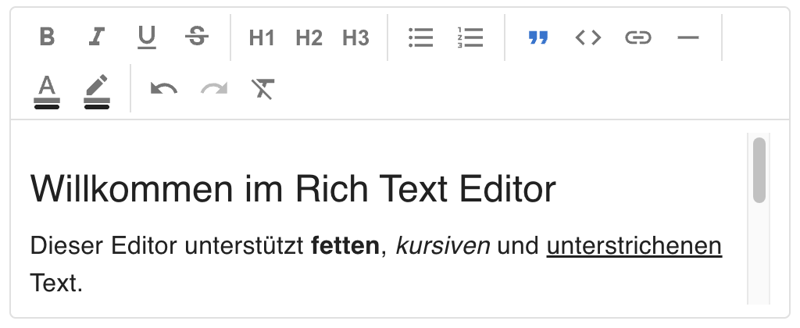

# RichTextEditor — Benutzerhandbuch

## Überblick

Der `RichTextEditor` ist ein vollständiger WYSIWYG-Texteditor auf Basis von [TipTap v3](https://tiptap.dev) und Material UI. Er bietet eine formatreiche Eingabeoberfläche für Inhalte wie CMS-Texte, E-Mail-Templates, Kommentare und Beschreibungsfelder — vollständig in das MUI-Theme integriert, ohne externe CSS-Abhängigkeiten.

**Typische Einsatzgebiete:**

- CMS-Formulare und Content-Management
- Beschreibungsfelder in Ticketsystemen oder Projektmanagement-Tools
- E-Mail-Template-Editoren
- Kommentarfelder mit Formatierungsmöglichkeiten
- Formularfelder die mehr als `<TextField multiline>` benötigen



---

## Technische Voraussetzungen

| Abhängigkeit | Mindestversion |
|---|---|
| React | 19 |
| TypeScript | 5.x |
| Material UI (`@mui/material`) | 9 |
| `@tiptap/react` | 3.x |
| `@tiptap/starter-kit` | 3.x |
| `@tiptap/extension-placeholder` | 3.x |
| `@tiptap/extension-character-count` | 3.x |
| `@tiptap/extension-text-style` | 3.x |
| `@tiptap/extension-color` | 3.x |
| `@tiptap/extension-highlight` | 3.x |
| `tiptap-markdown` | 0.9.x |

---

## Import

```tsx
import {
  RichTextEditor,
  DEFAULT_RICH_TEXT_EDITOR_TRANSLATION,
  DEFAULT_RICH_TEXT_EDITOR_TOOLBAR_CONFIG,
} from '@tsdev/mui-ts-library';
import type {
  RichTextEditorProps,
  RichTextEditorOutputFormat,
  RichTextEditorToolbarConfig,
  RichTextEditorTranslation,
} from '@tsdev/mui-ts-library';
```

---

## Schnellstart

```tsx
import { RichTextEditor } from '@tsdev/mui-ts-library';

function App() {
  return (
    <RichTextEditor
      placeholder="Hier tippen …"
      onChange={(html) => console.log(html)}
    />
  );
}
```

---

## Props

| Prop | Typ | Standard | Beschreibung |
|---|---|---|---|
| `value` | `string` | — | Initialwert als HTML- oder JSON-String; ermöglicht kontrollierten Modus |
| `onChange` | `(value: string) => void` | — | Wird bei jeder Inhaltsänderung aufgerufen |
| `placeholder` | `string` | — | Platzhaltertext wenn der Editor leer ist |
| `outputFormat` | `RichTextEditorOutputFormat` | `"html"` | Ausgabeformat für `onChange` — `"html"` oder `"json"` |
| `height` | `number \| string` | `200` | Gesamthöhe des Editors (Toolbar + Inhalt). Zahlen → px. `"auto"` → füllt den umgebenden Flex-Container. Überschüssiger Inhalt scrollt vertikal. |
| `width` | `number \| string` | `"100%"` | Breite des Editors. Zahlen → px. Leer oder nicht gesetzt → 100% des Elternelements. |
| `showCharacterCount` | `boolean` | `false` | Zeigt Zeichenzähler unten rechts |
| `maxCharacters` | `number` | — | Maximale Zeichenanzahl — Eingabe wird bei Erreichen blockiert |
| `toolbarConfig` | `RichTextEditorToolbarConfig` | alle `true` | Einzelne Toolbar-Buttons ein-/ausblenden |
| `disabled` | `boolean` | `false` | Deaktiviert Editor und Toolbar vollständig |
| `readonly` | `boolean` | `false` | Schreibgeschützter Modus — keine Toolbar |
| `name` | `string` | — | Name für natives Form-Submit (verstecktes `<input type="hidden">`) |
| `error` | `boolean` | `false` | Roter Rahmen im Fehlerzustand |
| `helperText` | `string` | — | Hilfetext unter dem Editor (wie MUI TextField) |
| `translation` | `Partial<RichTextEditorTranslation>` | — | Abweichende Texte für Tooltips, Dialog und Zeichenzähler |
| `onBlur` | `() => void` | — | Wird aufgerufen wenn der Editor den Fokus verliert |
| `onFocus` | `() => void` | — | Wird aufgerufen wenn der Editor den Fokus erhält |

---

## TypeScript-Typen

### `RichTextEditorOutputFormat`

```ts
type RichTextEditorOutputFormat = "html" | "json";
```

### `RichTextEditorToolbarConfig`

```ts
type RichTextEditorToolbarConfig = {
  showBold?:           boolean;
  showItalic?:         boolean;
  showUnderline?:      boolean;
  showStrike?:         boolean;
  showHeading1?:       boolean;
  showHeading2?:       boolean;
  showHeading3?:       boolean;
  showBulletList?:     boolean;
  showOrderedList?:    boolean;
  showBlockquote?:     boolean;
  showCodeBlock?:      boolean;
  showLink?:           boolean;
  showHorizontalRule?: boolean;
  showTextColor?:      boolean;
  showHighlight?:      boolean;
  showUndoRedo?:       boolean;
  showClearFormat?:    boolean;
};
```

Standard-Konfiguration (alle `true`):

```tsx
import { DEFAULT_RICH_TEXT_EDITOR_TOOLBAR_CONFIG } from '@tsdev/mui-ts-library';
```

### `RichTextEditorTranslation`

```ts
type RichTextEditorTranslation = {
  // Toolbar-Tooltips
  bold:             string;
  italic:           string;
  underline:        string;
  strike:           string;
  heading1:         string;
  heading2:         string;
  heading3:         string;
  bulletList:       string;
  orderedList:      string;
  blockquote:       string;
  codeBlock:        string;
  link:             string;
  horizontalRule:   string;
  textColor:        string;
  removeTextColor:  string;
  highlight:        string;
  removeHighlight:  string;
  undo:             string;
  redo:             string;
  clearFormat:      string;
  // Link-Dialog
  linkDialogTitle:    string;
  linkDialogUrlLabel: string;
  linkDialogSave:     string;
  linkDialogCancel:   string;
  linkDialogRemove:   string;
  // Zeichenzähler ({count} und {max} werden zur Laufzeit ersetzt)
  characterCount:    string;
  characterCountMax: string;
};
```

Englische Standardwerte:

```tsx
import { DEFAULT_RICH_TEXT_EDITOR_TRANSLATION } from '@tsdev/mui-ts-library';
```

---

## Ausgabeformat

### HTML (Standard)

`onChange` liefert einen HTML-String, z. B.:

```html
<h2>Titel</h2><p>Text mit <strong>Fett</strong> und <em>Kursiv</em>.</p>
```

### JSON

```tsx
<RichTextEditor outputFormat="json" onChange={(json) => JSON.parse(json)} />
```

Der JSON-String entspricht dem TipTap/ProseMirror-Dokumentformat (kann direkt zurück an `value` übergeben werden).

---

## Kontrollierter Modus

```tsx
const [content, setContent] = useState('<p>Initialinhalt</p>');

<RichTextEditor
  value={content}
  onChange={setContent}
/>
```

Der Editor synchronisiert `value` → `editor.setContent()` automatisch, wenn sich der externe Wert ändert — ohne den Cursor zu verstellen.

---

## Textfarbe und Hervorhebung

Text markieren und über die Toolbar-Buttons **Textfarbe** (A-Icon) oder **Hervorheben** (Pinsel-Icon) eine Farbe aus der Palette wählen:

```tsx
<RichTextEditor placeholder="Markiere Text, dann wähle eine Farbe …" />
```

Beide Buttons zeigen eine farbige Indikatorlinie unter dem Icon — die zuletzt verwendete oder am Cursor aktive Farbe. Über den Regenbogen-Swatch in der Palette ist ein freier Farbwähler (nativer Browser-Picker) verfügbar. Der Papierkorb-Button entfernt die Farbe wieder.

Über `toolbarConfig` lassen sich beide Buttons einzeln ausblenden:

```tsx
<RichTextEditor
  toolbarConfig={{ showTextColor: false, showHighlight: false }}
/>
```

---

## Toolbar konfigurieren

Nur Bold, Italic und Underline:

```tsx
import { DEFAULT_RICH_TEXT_EDITOR_TOOLBAR_CONFIG } from '@tsdev/mui-ts-library';

<RichTextEditor
  toolbarConfig={{
    ...DEFAULT_RICH_TEXT_EDITOR_TOOLBAR_CONFIG,
    showHeading1: false,
    showHeading2: false,
    showHeading3: false,
    showBulletList: false,
    showOrderedList: false,
    showBlockquote: false,
    showCodeBlock: false,
    showLink: false,
    showHorizontalRule: false,
    showUndoRedo: false,
    showClearFormat: false,
  }}
/>
```

---

## Zeichenbegrenzung

```tsx
{/* Nur Anzeige, keine Begrenzung */}
<RichTextEditor showCharacterCount />

{/* Anzeige + Begrenzung auf 500 Zeichen */}
<RichTextEditor maxCharacters={500} />
```

Der Zähler färbt sich rot wenn das Limit erreicht ist.

---

## Höhe und Breite

Die Gesamtgröße des Editors (Toolbar + Inhaltsbereich) wird über `height` und `width` gesteuert. Numerische Werte werden automatisch in `px` umgewandelt; CSS-Strings wie `"50vh"` oder `"100%"` werden direkt übergeben.

```tsx
{/* Standard: 200px hoch, 100% breit */}
<RichTextEditor />

{/* Feste Höhe — Inhalt scrollt vertikal wenn er überläuft */}
<RichTextEditor height={400} />

{/* CSS-String direkt möglich */}
<RichTextEditor height="50vh" />

{/* "auto" — Editor füllt den umgebenden Flex-Container */}
<Box sx={{ height: 500, display: "flex", flexDirection: "column" }}>
  <RichTextEditor height="auto" />
</Box>

{/* Feste Breite */}
<RichTextEditor width={600} />

{/* Kombiniert */}
<RichTextEditor height={300} width="80%" />
```

**Hinweis zu `height="auto"`:** Der umgebende Container muss `display: flex` und `flex-direction: column` haben, damit sich der Editor daran orientieren kann.

---

## Markdown einfügen (Paste)

Der Editor konvertiert eingefügten Markdown-Text automatisch in Rich-Text. Kopierter Inhalt aus `.md`-Dateien, GitHub READMEs oder Markdown-Editoren wird korrekt formatiert:

| Markdown-Syntax | Ergebnis |
|---|---|
| `## Überschrift` | H2-Heading |
| `**fett**` / `*kursiv*` | Fett / Kursiv |
| `- Punkt` / `1. Punkt` | Bullet-List / Numbered-List |
| `> Zitat` | Blockquote |
| `` `code` `` | Inline-Code |
| `[Text](url)` | Klickbarer Link |

**Hinweis:** Diese Konvertierung greift nur bei Inhalten aus der Zwischenablage (Plain-Text-Clipboard). Inhalte, die aus gerenderten Quellen (z.B. GitHub-Webansicht) kopiert werden, bringen bereits HTML mit und werden über den normalen HTML-Pfad eingefügt.

---

## Readonly und Disabled

```tsx
{/* Kein Editieren, keine Toolbar — reine Darstellung */}
<RichTextEditor value={content} readonly />

{/* Editor ausgegraut, Toolbar deaktiviert */}
<RichTextEditor value={content} disabled />
```

---

## Form-Integration

### React Hook Form

```tsx
import { useForm, Controller } from 'react-hook-form';
import { RichTextEditor } from '@tsdev/mui-ts-library';

function MyForm() {
  const { control, handleSubmit, formState: { errors } } = useForm<{ description: string }>();

  return (
    <form onSubmit={handleSubmit(console.log)}>
      <Controller
        name="description"
        control={control}
        rules={{ required: 'Beschreibung ist erforderlich' }}
        render={({ field }) => (
          <RichTextEditor
            value={field.value}
            onChange={field.onChange}
            onBlur={field.onBlur}
            error={!!errors.description}
            helperText={errors.description?.message}
          />
        )}
      />
    </form>
  );
}
```

### Native Form-Submission

```tsx
<form action="/submit" method="POST">
  <RichTextEditor name="content" />
  <button type="submit">Absenden</button>
</form>
```

Der Wert wird über ein verstecktes `<input type="hidden" name="content">` im Formular mitgeschickt.

---

## i18n — Übersetzungen

Nur abweichende Schlüssel angeben — alle anderen behalten den Standardwert:

```tsx
import { DEFAULT_RICH_TEXT_EDITOR_TRANSLATION } from '@tsdev/mui-ts-library';

const DE_TRANSLATION = {
  bold:             "Fett",
  italic:           "Kursiv",
  underline:        "Unterstrichen",
  strike:           "Durchgestrichen",
  heading1:         "Überschrift 1",
  heading2:         "Überschrift 2",
  heading3:         "Überschrift 3",
  bulletList:       "Aufzählung",
  orderedList:      "Nummerierte Liste",
  blockquote:       "Zitat",
  codeBlock:        "Code-Block",
  link:             "Link einfügen",
  horizontalRule:   "Trennlinie",
  textColor:        "Textfarbe",
  removeTextColor:  "Textfarbe entfernen",
  highlight:        "Hervorheben",
  removeHighlight:  "Hervorhebung entfernen",
  undo:             "Rückgängig",
  redo:             "Wiederholen",
  clearFormat:      "Formatierung löschen",
  linkDialogTitle:    "Link einfügen",
  linkDialogUrlLabel: "URL",
  linkDialogSave:     "Speichern",
  linkDialogCancel:   "Abbrechen",
  linkDialogRemove:   "Link entfernen",
  characterCount:    "{count} Zeichen",
  characterCountMax: "{count} / {max} Zeichen",
};

<RichTextEditor translation={DE_TRANSLATION} />
```

Das Merge-Muster ist `{ ...DEFAULT_RICH_TEXT_EDITOR_TRANSLATION, ...translation }` — nur überschriebene Schlüssel müssen angegeben werden.

---

## Fehlerzustand

```tsx
<RichTextEditor
  error={true}
  helperText="Dieses Feld ist erforderlich."
/>
```

Der Editor-Rahmen erscheint in `error.main` (MUI-Fehlerfarbe), der `helperText` darunter ebenfalls in Rot — analog zum MUI `TextField`.

---

## API-Callbacks

| Callback | Signatur | Auslöser |
|---|---|---|
| `onChange` | `(value: string) => void` | Jede Inhaltsänderung (Tippen, Formatieren, Einfügen) |
| `onBlur` | `() => void` | Editor verliert den Fokus |
| `onFocus` | `() => void` | Editor erhält den Fokus |

**Wichtig:** `onChange` feuert NICHT wenn `value` von außen über die Prop gesetzt wird (externer Sync via `setContent`). Dies verhindert Endlosschleifen im kontrollierten Modus.

---

## Architektur-Entscheidungen

| Thema | Entscheidung |
|---|---|
| **Kein Zustand-Store** | TipTap `useEditor` verwaltet den Editor-State intern |
| **Kein CSS** | Ausschließlich MUI `sx`-Prop und `.ProseMirror`-Selector |
| **TipTap v3** | StarterKit enthält bereits `Link` und `Underline` — keine separaten Imports |
| **`shouldRerenderOnTransaction: true`** | Notwendig in TipTap v3 damit Toolbar-Buttons ihren aktiven Zustand reflektieren |
| **`onMouseDown` preventDefault** | Jeder Toolbar-Button verhindert damit das Blur des Editors beim Klicken |
| **`height` auf `Paper`** | Die Gesamthöhe (Toolbar + Inhalt) sitzt auf dem `Paper`-Wrapper; der Inhaltsbereich füllt den Rest über `flex: 1` |
| **`normalizeSize()`** | Konvertiert numerische Strings (`"300"`) zu Zahlen, damit MUI `px` anhängt — ermöglicht Storybook-Text-Controls |
| **`tiptap-markdown`** | Freies Community-Paket (`transformPastedText: true`) — kein TipTap-Pro erforderlich |
