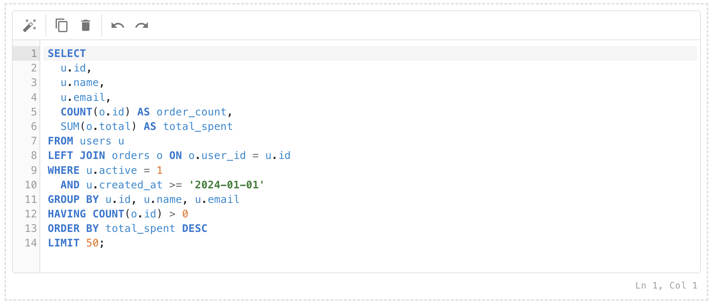

# SqlEditor — Benutzerhandbuch

> [English Version →](SqlEditor.md)

## Übersicht

Der `SqlEditor` ist ein vollwertiger SQL-Code-Editor auf Basis [CodeMirror 6](https://codemirror.net/) mit demselben MUI-Paper-Layout wie der `RichTextEditor`. Er bietet eine komfortable SQL-Eingabe für Query-Builder, Admin-Tools, BI-Dashboards und Datenbank-Frontends — vollständig in das MUI-Theme integriert, ohne externe CSS-Abhängigkeiten.

**Typische Anwendungsfälle:**

- Query-Builder und SQL-Playgrounds
- Admin-Tools und Datenbank-Frontends
- BI-Dashboards mit Abfrage-Eingabe
- Formularfelder für SQL-Konfigurationswerte



---

## Voraussetzungen

| Abhängigkeit | Mindestversion |
|---|---|
| React | 19 |
| TypeScript | 5.x |
| Material UI (`@mui/material`) | 9 |
| `@codemirror/view` | 6.x |
| `@codemirror/state` | 6.x |
| `@codemirror/lang-sql` | 6.x |
| `@codemirror/commands` | 6.x |
| `@codemirror/lint` | 6.x |
| `@codemirror/autocomplete` | 6.x |
| `@codemirror/language` | 6.x |
| `@lezer/highlight` | 1.x |
| `sql-formatter` | 15.x |

---

## Import

```tsx
import {
  SqlEditor,
  DEFAULT_SQL_EDITOR_TOOLBAR_CONFIG,
  DEFAULT_SQL_EDITOR_TRANSLATION,
} from '@thebuoyant-tsdev/mui-ts-library';
import type {
  SqlEditorProps,
  SqlEditorDialect,
  SqlEditorToolbarConfig,
  SqlEditorTranslation,
  SqlEditorHighlightColors,
  SqlLintError,
  SqlSchema,
  SqlTable,
  SqlColumn,
} from '@thebuoyant-tsdev/mui-ts-library';
```

---

## Schnellstart

```tsx
import { SqlEditor } from '@thebuoyant-tsdev/mui-ts-library';

function App() {
  return (
    <SqlEditor
      placeholder="SQL-Abfrage eingeben …"
      onChange={(sql) => console.log(sql)}
    />
  );
}
```

---

## Props

| Prop | Typ | Standard | Beschreibung |
|---|---|---|---|
| `dialect` | `SqlEditorDialect` | `"standard"` | SQL-Dialekt für Syntax-Highlighting und Formatierung |
| `disabled` | `boolean` | `false` | Deaktiviert Editor und Toolbar vollständig |
| `error` | `boolean` | `false` | Roter Rahmen im Fehlerzustand |
| `height` | `number \| string` | `300` | Gesamthöhe (Toolbar + Inhalt). Zahlen → px. `"auto"` → füllt den umgebenden Flex-Container. |
| `helperText` | `string` | — | Hilfetext unterhalb des Editors (wie MUI TextField) |
| `highlightColors` | `SqlEditorHighlightColors` | — | Syntax-Highlight-Farben für Keywords, Strings und Identifier |
| `name` | `string` | — | Name für native Formularübermittlung (verstecktes `<input type="hidden">`) |
| `placeholder` | `string` | — | Platzhaltertext bei leerem Editor |
| `readonly` | `boolean` | `false` | Nur-Lesen-Modus — keine Toolbar |
| `schema` | `SqlSchema` | — | Tabellen- und Spaltendefinitionen für Schema-aware Autocomplete |
| `showErrorCount` | `boolean` | `false` | Fehleranzahl im Footer ein-/ausblenden (benötigt `onLint`) |
| `showLineColumn` | `boolean` | `true` | Cursor-Position (Ln / Col) im Footer ein-/ausblenden |
| `showLineNumbers` | `boolean` | `true` | Zeilennummern ein-/ausblenden |
| `toolbarConfig` | `SqlEditorToolbarConfig` | alle `true` außer `showExecute` | Toolbar-Schaltflächen einzeln ein-/ausblenden |
| `translation` | `Partial<SqlEditorTranslation>` | — | UI-Texte für Toolbar-Tooltips und Footer überschreiben |
| `value` | `string` | — | SQL-Inhalt; aktiviert den kontrollierten Modus |
| `width` | `number \| string` | `"100%"` | Breite des Editors. Zahlen → px. |
| `onBlur` | `() => void` | — | Wird aufgerufen wenn der Editor den Fokus verliert |
| `onChange` | `(sql: string) => void` | — | Bei jeder Inhaltsänderung aufgerufen |
| `onExecute` | `(sql: string) => void` | — | Wird bei Klick auf Ausführen aufgerufen (benötigt `toolbarConfig.showExecute: true`) |
| `onFocus` | `() => void` | — | Wird aufgerufen wenn der Editor den Fokus erhält |
| `onLint` | `(sql: string) => Promise<SqlLintError[]> \| SqlLintError[]` | — | Asynchroner Lint-Callback — Fehler werden als Wellenlinien im Editor angezeigt |

---

## TypeScript-Typen

### `SqlEditorDialect`

```ts
type SqlEditorDialect = "standard" | "mysql" | "postgresql" | "sqlite" | "mssql";
```

### `SqlLintError`

```ts
type SqlLintError = {
  line:      number;
  col?:      number;
  message:   string;
  severity?: "error" | "warning" | "info";
};
```

### `SqlEditorToolbarConfig`

```ts
type SqlEditorToolbarConfig = {
  showFormat?:   boolean;  // SQL-Formatieren-Schaltfläche
  showCopy?:     boolean;  // In Zwischenablage kopieren
  showClear?:    boolean;  // Editor leeren
  showExecute?:  boolean;  // Ausführen-Schaltfläche (standardmäßig aus)
  showUndoRedo?: boolean;  // Rückgängig / Wiederholen
};
```

Standard-Konfiguration:

```tsx
import { DEFAULT_SQL_EDITOR_TOOLBAR_CONFIG } from '@thebuoyant-tsdev/mui-ts-library';
// { showFormat: true, showCopy: true, showClear: true, showExecute: false, showUndoRedo: true }
```

### `SqlEditorTranslation`

```ts
type SqlEditorTranslation = {
  format:      string;   // "Format SQL"
  copy:        string;   // "Copy"
  copySuccess: string;   // "Copied!"
  clear:       string;   // "Clear"
  execute:     string;   // "Execute"
  undo:        string;   // "Undo"
  redo:        string;   // "Redo"
  lineColumn:  string;   // "Ln {line}, Col {col}"
  errorCount:  string;   // "{count} error(s)"
};
```

```tsx
import { DEFAULT_SQL_EDITOR_TRANSLATION } from '@thebuoyant-tsdev/mui-ts-library';
```

### `SqlEditorHighlightColors`

```ts
type SqlEditorHighlightColors = {
  keyword?:    string;   // SQL-Keywords (SELECT, FROM, WHERE …) — Standard: theme primary.main, fett
  string?:     string;   // String-Literale ('wert') — Standard: theme success.main, fett
  identifier?: string;   // Identifier: Tabellen-/Spaltennamen, Aliase — Standard: theme info.main
};
```

### `SqlSchema`, `SqlTable`, `SqlColumn`

```ts
type SqlColumn = {
  name:  string;
  type?: string;   // Als Detail-Hinweis im Autocomplete-Tooltip angezeigt (z. B. "INT", "VARCHAR")
};

type SqlTable = {
  name:     string;
  columns?: SqlColumn[];
};

type SqlSchema = {
  tables: SqlTable[];
};
```

---

## Kontrollierter Modus

```tsx
const [sql, setSql] = useState('SELECT * FROM users;');

<SqlEditor
  value={sql}
  onChange={setSql}
/>
```

Der Editor synchronisiert `value` → CodeMirror-Dokument bei Änderungen von außen — ohne den Cursor zu verschieben.

---

## Syntax-Highlighting

Farben kommen standardmäßig aus dem aktiven MUI-Theme:

| Token | Standardfarbe | Stil |
|---|---|---|
| Keywords (`SELECT`, `FROM`, `WHERE` …) | `primary.main` | **fett** |
| String-Literale (`'wert'`) | `success.main` | **fett** |
| Identifier (Tabellen-/Spaltennamen, Aliase) | `info.main` | — |
| Zahlen (`42`, `3.14`) | `warning.main` | — |
| Funktionen (`COUNT`, `SUM`, `COALESCE` …) | `secondary.main` | — |
| Kommentare (`--`, `/* */`) | `text.disabled` | *kursiv* |
| Operatoren (`=`, `>`, `AND` …) | `text.secondary` | — |
| Fehler-Token | `error.main` | Wellenlinie |

Dark Mode wird automatisch unterstützt — alle Farben kommen aus dem aktiven MUI-Theme.

### Eigene Highlight-Farben

Die drei Haupt-Token-Farben können über `highlightColors` überschrieben werden:

```tsx
import type { SqlEditorHighlightColors } from '@thebuoyant-tsdev/mui-ts-library';

// One Dark Theme Farben
const colors: SqlEditorHighlightColors = {
  keyword:    '#c678dd',   // Lila
  string:     '#98c379',   // Grün
  identifier: '#e5c07b',   // Gold
};

<SqlEditor value={sql} highlightColors={colors} />
```

---

## SQL-Dialekte

```tsx
<SqlEditor dialect="postgresql" value={sql} />
```

| Dialekt | Wert | Formatter-Sprache |
|---|---|---|
| Standard SQL | `"standard"` | `sql` |
| MySQL | `"mysql"` | `mysql` |
| PostgreSQL | `"postgresql"` | `postgresql` |
| SQLite | `"sqlite"` | `sqlite` |
| MS SQL Server | `"mssql"` | `tsql` |

Der Dialekt beeinflusst sowohl das Syntax-Highlighting (dialektspezifische Keywords) als auch den Format-Button (sql-formatter verwendet die passende Sprache).

---

## Toolbar

Die Toolbar erscheint oberhalb des Editors (im Readonly-Modus ausgeblendet). Jede Schaltfläche kann einzeln ein- oder ausgeblendet werden:

| Schaltfläche | Standard | Beschreibung |
|---|---|---|
| Formatieren (`AutoFixHigh`) | sichtbar | SQL verschönern via `sql-formatter` |
| Kopieren (`ContentCopy`) | sichtbar | SQL in Zwischenablage; zeigt „Kopiert!" für 2 s |
| Leeren (`Delete`) | sichtbar | Editor-Inhalt löschen |
| Rückgängig (`Undo`) | sichtbar | Letzte Änderung rückgängig machen |
| Wiederholen (`Redo`) | sichtbar | Letzte rückgängig gemachte Änderung wiederherstellen |
| Ausführen (`PlayArrow`) | **ausgeblendet** | Ruft `onExecute(sql)` auf |

```tsx
// Ausführen anzeigen, Formatieren ausblenden
<SqlEditor
  toolbarConfig={{ showExecute: true, showFormat: false }}
  onExecute={(sql) => runQuery(sql)}
/>

// Readonly — keine Toolbar
<SqlEditor readonly value={sql} />
```

---

## Ausführen-Schaltfläche

```tsx
<SqlEditor
  value={sql}
  toolbarConfig={{ showExecute: true }}
  onExecute={(sql) => {
    console.log('Abfrage ausführen:', sql);
    runQuery(sql);
  }}
/>
```

Die Ausführen-Schaltfläche ist standardmäßig ausgeblendet. Sie erscheint nur wenn sowohl `toolbarConfig.showExecute: true` als auch ein `onExecute`-Handler angegeben sind.

---

## Linting

Lint-Fehler werden als Wellenlinien im Editor angezeigt. Der `onLint`-Callback wird mit 600 ms Debounce nach jeder Änderung aufgerufen.

```tsx
<SqlEditor
  value={sql}
  showErrorCount
  onLint={async (sql) => {
    const res = await fetch('/api/lint', {
      method: 'POST',
      body: sql,
      headers: { 'Content-Type': 'text/plain' },
    });
    return res.json(); // SqlLintError[]
  }}
/>
```

Das `SqlLintError`-Format:

```ts
{ line: 1, col: 10, message: "Unbekanntes Keyword 'FORM'", severity: "error" }
```

- `severity` wird als `"error"` behandelt wenn nicht angegeben
- `col` fällt auf den Zeilenanfang zurück wenn nicht angegeben
- `showErrorCount` zeigt `⚠ N Fehler` im Footer

Zusätzlich erscheint ein farbiger Punkt im Zeilennummern-Gutter für jeden Fehler.

---

## Schema-aware Autocomplete

Tabellen- und Spaltendefinitionen bereitstellen, damit der Editor sie beim Tippen vorschlägt:

```tsx
import type { SqlSchema } from '@thebuoyant-tsdev/mui-ts-library';

const schema: SqlSchema = {
  tables: [
    {
      name: 'users',
      columns: [
        { name: 'id',         type: 'INT' },
        { name: 'name',       type: 'VARCHAR' },
        { name: 'email',      type: 'VARCHAR' },
        { name: 'active',     type: 'BOOLEAN' },
        { name: 'created_at', type: 'TIMESTAMP' },
      ],
    },
    {
      name: 'orders',
      columns: [
        { name: 'id',         type: 'INT' },
        { name: 'user_id',    type: 'INT' },
        { name: 'total',      type: 'DECIMAL' },
        { name: 'status',     type: 'VARCHAR' },
        { name: 'created_at', type: 'TIMESTAMP' },
      ],
    },
  ],
};

<SqlEditor value="SELECT " schema={schema} />
```

Das `type`-Feld jeder Spalte erscheint als Detail-Hinweis neben dem Vorschlag im Autocomplete-Dropdown. SQL-Keywords werden immer zusätzlich zu Schema-Einträgen vorgeschlagen.

---

## Footer

```tsx
{/* Nur Cursor-Position */}
<SqlEditor showLineColumn />

{/* Fehleranzahl + Cursor-Position */}
<SqlEditor showLineColumn showErrorCount onLint={myLinter} />

{/* Hilfetext (wie MUI TextField) */}
<SqlEditor error helperText="Ungültige SQL-Syntax." />

{/* Footer vollständig ausblenden */}
<SqlEditor showLineColumn={false} showErrorCount={false} />
```

Der Footer wird nur gerendert wenn mindestens eines von `showLineColumn`, `showErrorCount` oder `helperText` gesetzt ist.

---

## Höhe und Breite

```tsx
{/* Standard: 300px hoch, 100% breit */}
<SqlEditor />

{/* Feste Höhe — Inhalt scrollt vertikal */}
<SqlEditor height={400} />

{/* CSS-String */}
<SqlEditor height="50vh" />

{/* "auto" — füllt den umgebenden Flex-Container */}
<Box sx={{ height: 500, display: "flex", flexDirection: "column" }}>
  <SqlEditor height="auto" />
</Box>

{/* Feste Breite */}
<SqlEditor width={800} />
```

**Hinweis zu `height="auto"`:** Der umgebende Container benötigt `display: flex` und `flex-direction: column`.

---

## Readonly und Disabled

```tsx
{/* Nur-Lesen — keine Toolbar, kein blinkender Cursor */}
<SqlEditor value={sql} readonly />

{/* Deaktiviert — Toolbar und Editor ausgegraut */}
<SqlEditor value={sql} disabled />
```

---

## Formular-Integration

### React Hook Form

```tsx
import { useForm, Controller } from 'react-hook-form';
import { SqlEditor } from '@thebuoyant-tsdev/mui-ts-library';

function QueryForm() {
  const { control, handleSubmit, formState: { errors } } = useForm<{ query: string }>();

  return (
    <form onSubmit={handleSubmit(console.log)}>
      <Controller
        name="query"
        control={control}
        rules={{ required: 'SQL-Abfrage ist erforderlich' }}
        render={({ field }) => (
          <SqlEditor
            value={field.value}
            onChange={field.onChange}
            onBlur={field.onBlur}
            error={!!errors.query}
            helperText={errors.query?.message}
          />
        )}
      />
      <button type="submit">Ausführen</button>
    </form>
  );
}
```

### Native Formularübermittlung

```tsx
<form action="/execute" method="POST">
  <SqlEditor name="query" />
  <button type="submit">Ausführen</button>
</form>
```

Der Wert wird über ein verstecktes `<input type="hidden" name="query">` im Formular übermittelt.

---

## i18n — Übersetzungen

Nur die zu überschreibenden Schlüssel angeben — alle anderen behalten ihren Standardwert:

```tsx
import { DEFAULT_SQL_EDITOR_TRANSLATION } from '@thebuoyant-tsdev/mui-ts-library';

const DE = {
  format:      "Formatieren",
  copy:        "Kopieren",
  copySuccess: "Kopiert!",
  clear:       "Leeren",
  execute:     "Ausführen",
  undo:        "Rückgängig",
  redo:        "Wiederholen",
  lineColumn:  "Zeile {line}, Sp. {col}",
  errorCount:  "{count} Fehler",
};

<SqlEditor translation={DE} />
```

Die Platzhalter `{line}`, `{col}` und `{count}` werden zur Laufzeit ersetzt.

---

## Storybook-Stories

| Story | Beschreibung |
|---|---|
| `Default` | Leerer Editor mit Platzhaltertext |
| `WithQuery` | Mit einer Beispiel-SELECT-Abfrage |
| `WithFixedHeight` | Lange Abfrage in einem 200px-hohen Editor (scrollbar) |
| `WithAutoHeight` | Editor füllt einen 400px Flex-Container |
| `Controlled` | Vollständig kontrolliert mit `useState` |
| `MySQLDialect` | MySQL-spezifische Syntax |
| `PostgreSQLDialect` | PostgreSQL-spezifische Syntax |
| `WithExecute` | Ausführen-Schaltfläche sichtbar |
| `WithSchema` | Schema-aware Autocomplete mit 3 Tabellen |
| `WithLinting` | Server-seitiges Linting mit simulierten Fehlern |
| `WithFormat` | Format-Schaltfläche mit unformatiertem SQL |
| `CustomHighlightColors` | One Dark Farbschema |
| `NoLineNumbers` | Zeilennummern und Cursor-Position ausgeblendet |
| `ReadOnly` | Keine Toolbar, Nur-Lesen-Inhalt |
| `Disabled` | Ausgegraut, nicht interaktiv |
| `WithError` | Roter Rahmen + Hilfetext |
| `GermanTranslation` | Toolbar und Footer auf Deutsch |

---

## Architektur-Entscheidungen

| Thema | Entscheidung |
|---|---|
| **CodeMirror 6** | ~150 kB vs. Monaco ~2 MB; vollständiger SQL-Support, MUI-themebar, genutzt von Replit / Observable / CodeSandbox |
| **Kein Monaco** | 2–3 MB Bundle, schwer ins MUI-Theme integrierbar, für eingebetteten Editor überdimensioniert |
| **`Compartment`** | `editable`- und `readOnly`-Zustand werden dynamisch via CodeMirror `Compartment` rekonfiguriert — vermeidet vollständige Editor-Neuerstellung bei Prop-Änderung |
| **Editor-Neuerstellung** | Vollständige Neuerstellung nur bei Änderung von `isDark`, `dialect`, `hasLint`, `highlightColors` oder `schema` — `value`, `disabled` und `readonly` werden ohne Neuerstellung synchronisiert |
| **`onLint`-Ref** | Lint-Callback in einem Ref gespeichert um Stale-Closures zu vermeiden — der Linter ruft immer die aktuellste Version auf |
| **`schemaKey`** | `JSON.stringify(schema)` als stabiler primitiver Dependency-Wert für `useEffect` |
| **`sql-formatter`** | Dialekt-Mapping: `standard→sql`, `mysql→mysql`, `postgresql→postgresql`, `sqlite→sqlite`, `mssql→tsql`; try/catch lässt den Editor unverändert wenn das SQL nicht parsebar ist |
| **`normalizeSize()`** | Konvertiert numerische Strings (`"300"`) zu Zahlen, damit MUI `px` anhängt — ermöglicht Storybook-Text-Controls |
| **`height="auto"`** | Bei `auto` verwendet der Editor `flex: 1` auf der äußeren `Box` und der `Paper`-Komponente um den umgebenden Flex-Container zu füllen |
| **Footer außerhalb Paper** | `SqlEditorFooter` befindet sich außerhalb des `Paper`-Rahmens, damit `helperText` dem MUI-TextField-Muster entspricht |
